## Table of Contents

* [Initial exploration](https://github.com/curiousest/session-hourly-rate/blob/master/analysis.md#initial-exploration)
* [Data visualization](https://github.com/curiousest/session-hourly-rate/blob/master/analysis.md#data-visualization)
  * [Overall](https://github.com/curiousest/session-hourly-rate/blob/master/analysis.md#data-visualization)
  * [For sessions that occurred at a particular time of day](https://github.com/curiousest/session-hourly-rate/blob/master/analysis.md#for-sessions-that-occurred-at-a-particular-time-of-day)
  * [For sessions that were a particular length](https://github.com/curiousest/session-hourly-rate/blob/master/analysis.md#for-sessions-that-were-a-particular-length)
  * [For sessions starting each day of the week](https://github.com/curiousest/session-hourly-rate/blob/master/analysis.md#for-sessions-starting-on-each-day-of-the-week)
* [Predictive analysis](https://github.com/curiousest/session-hourly-rate/blob/master/analysis.md#predictive-analysis)
* [Statistical analysis](https://github.com/curiousest/session-hourly-rate/blob/master/analysis.md#statistical-analysis)

## Initial exploration

[Data exploration notebook](hourly_explore.ipynb)

I started by exploring the data with basic counts/averages/max/mins and extracting some time features that seemed relevant. Then I explored visualizing hourly rate vs. fill rate to understand the high-level relationship. I found that there was different amounts of data for different hourly rates, so I made visual adjustments to the graphs.

## Data visualization

[Data visualization notebook](hourly_visualization.ipynb)

First, I made high level summary visualizations. Fill rates seem to trend upwards to 90, then plateau. There are some off-trendline fill rates at some hourly rates.

### Overall fill rate (%)

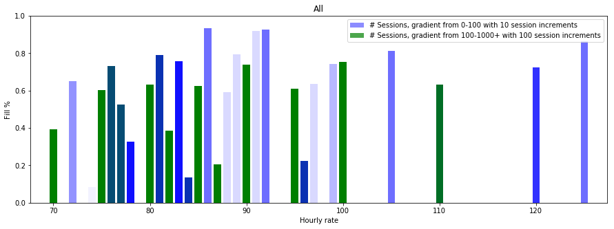

### Overall absolute filled/unfilled numbers

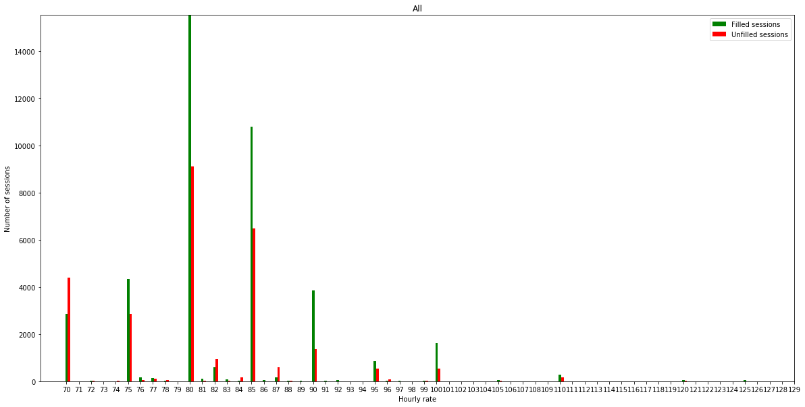

Next, I made similar visualizations that take into consideration several time features. Some differences were notable:

* Morning > Afternoon > Night
* Lower fill rate of long sessions
* Weekend fill rates are worse

### For sessions that occurred at a particular time of day

#### Morning

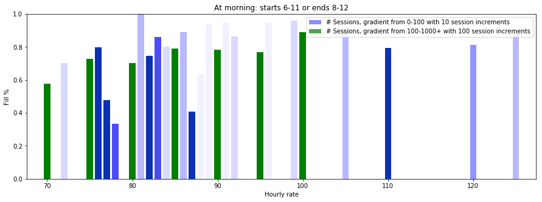

#### Afternoon

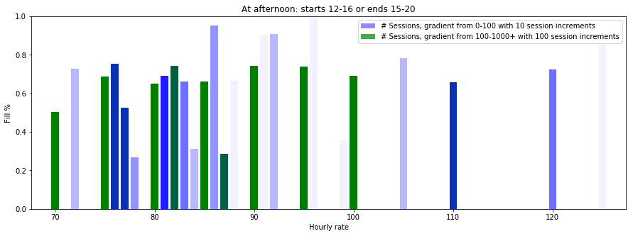

#### Night

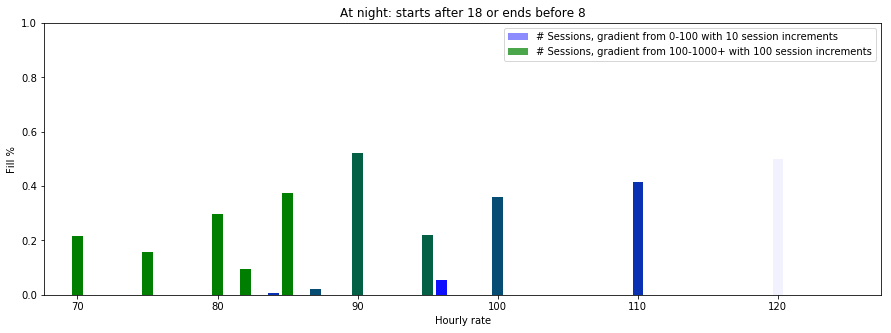

### For sessions that were a particular length

#### Short

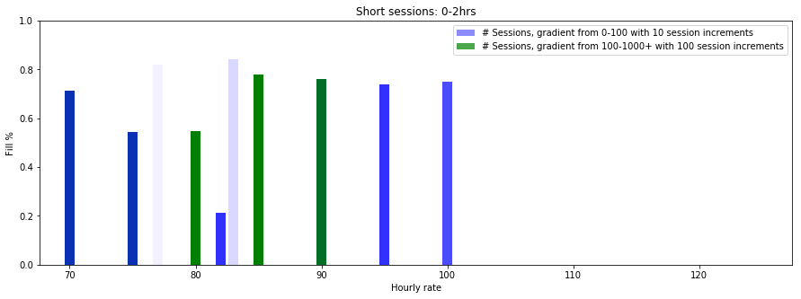

#### Medium

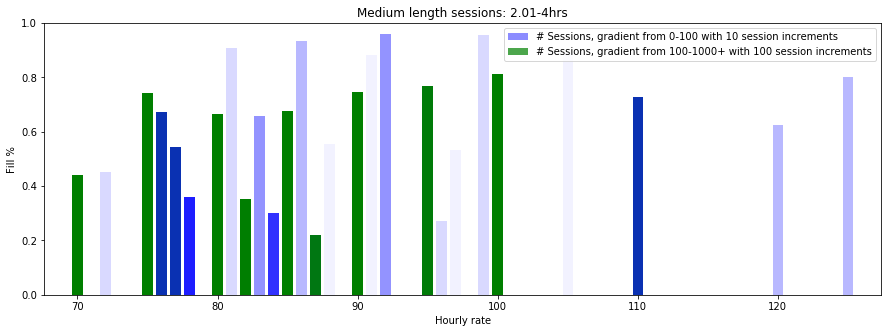

#### Long

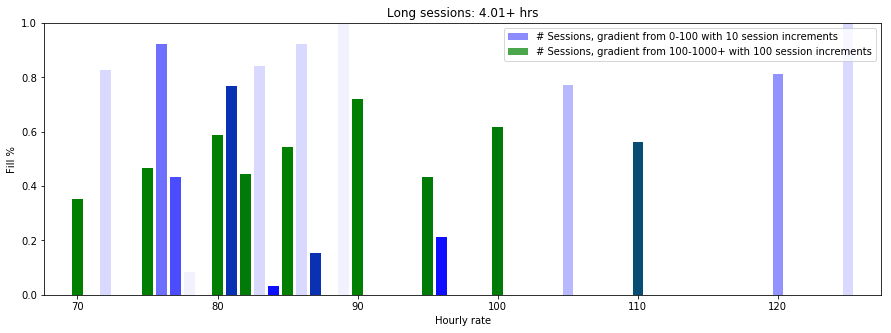

### For sessions that were a particular length

#### Short

#### Medium

#### Long

### For sessions starting on each day of the week

#### Monday 

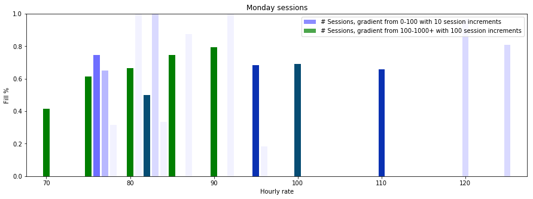

#### Tuesday

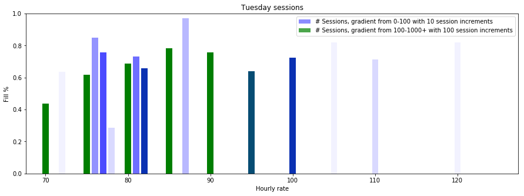

#### Wednesday

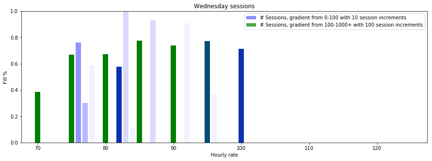

#### Thursday

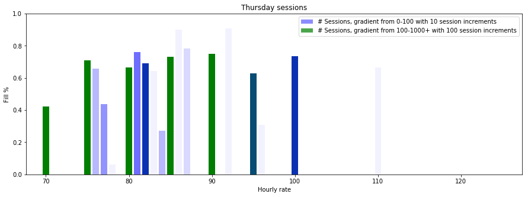

#### Friday

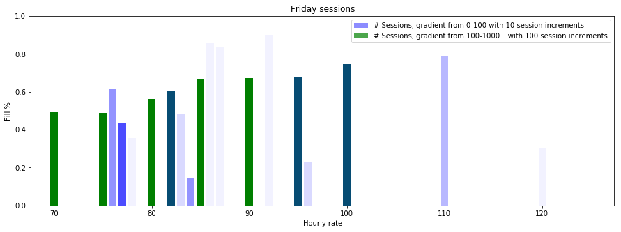

#### Saturday

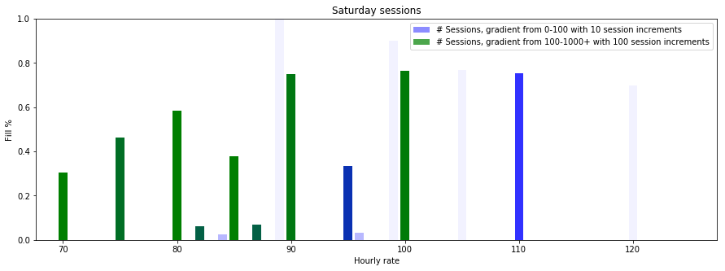

#### Sunday

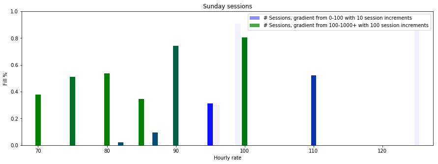

## Predictive Analysis

[Predictive analysis notebook](hourly_predictive_analysis.ipynb)

I made a predictive model to see if the features could be used to predict fill rate, and whether hourly rate was a useful feature in predicting fill rate (meaning it influences fill rate and isn't explained by other features).

First, I made a decision tree model. I found that it was overfitting against the time features because it performed more poorly using time features than not using them. I guessed that this was because there wasn't enough data for some hourly rates, so I used a Support Vector Regressor.

The difference in predictive power between using or not using hourly rate as a feature was 0.35% on the F1 score and 0.5% accuracy (when also using practice id, ccg id, and time features). This means hourly rate is mostly explained by those other features.

This could, for example, mean:

* If the session is at a different time of day, it could have a propensity to have a different hourly rate
* Sessions in different ccgs correlate with certain hourly rates
* Sessions at different practices correlate with certain hourly rates

## Statistical Analysis

[Statistical analysis notebook](hourly_variables_analysis.ipynb)

I analyzed how changes to hourly rate affects fill rate, comparing fill rates between two groups of sessions with the same time features and one of two hourly rates. For each hourly rate ∈ [60, 130] and for each hourly rate difference ∈ [1, 10], I found the difference in fill rate after adding the hourly rate difference.
 
To come up with a fill rate difference for a given hourly rate difference (and overall for all hourly rates), I weighted the fill rate difference by the minimum of the before and after fill rate.

Ex:

For hourly rate = 60, 5 filled, 15 unfilled.
For hourly rate = 65, 10 filled, 20 unfilled.
For hourly rate = 70, 15 filled, 25 unfilled.

For hourly rate difference = 5:
Fill rate difference between 60 and 65 = (10/(10 + 20)) - (5/(5 + 15)), weight = min(5 + 15, 10 + 20)
Fill rate difference between 65 and 70 = (15/(15 + 25)) - (10/(10 + 20)), weight = min(10 + 20, 15 + 25)

Overall fill rate difference for hourly rate difference = 5:
(weight of 60->65)/(total of all weights) x (fill rate difference 60->65) +
(weight of 65->70)/(total of all weights) x (fill rate difference 65->70)

The differences had to be weighted by their vague probability of occurring. I also wanted to prevent situations where the previous hourly rate had 1 instance, but the afterwards hourly rate had 10000s of instances, and so was weighted heavily. In that case, the weight should be low, hence the minimum of the two values.
 
Overall, this is how hourly rate affects fill rate (based on above assumtions/calculations):

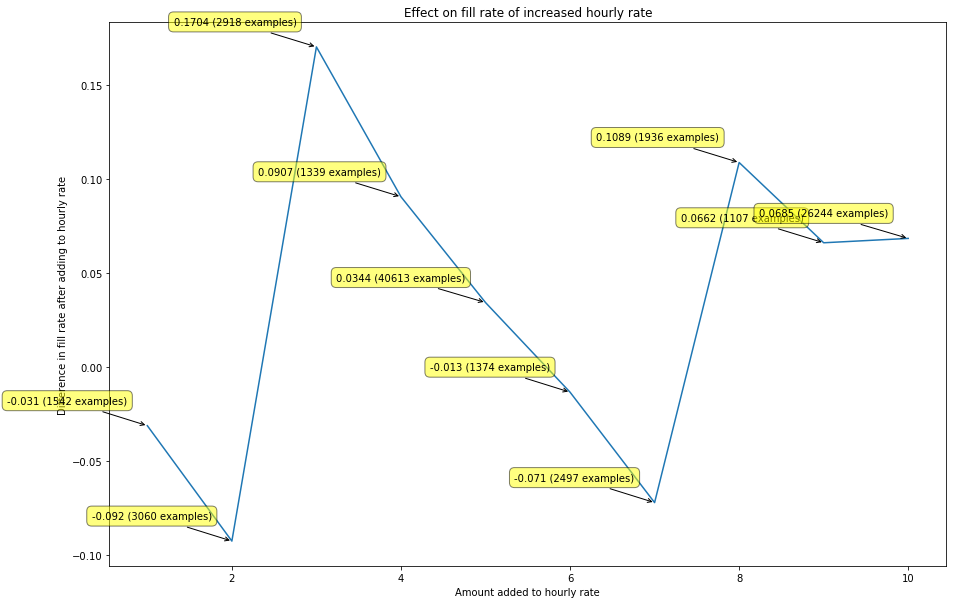

Selecting just the hourly rates falling on increments of 5, this is how hourly rate affects fill rate:

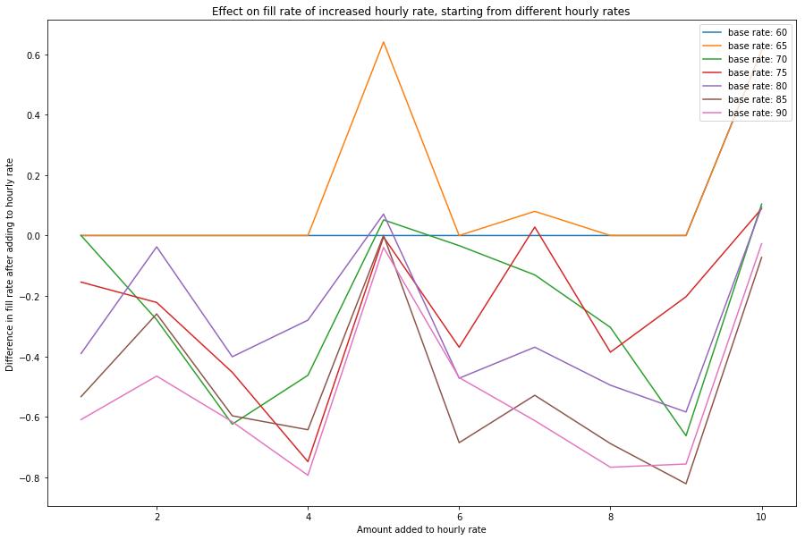

Most data being below 0 is likely because hourly rates not falling on increments of 5 have low fill rates, when compared with those that do fall on increments of 5. Note that practice and ccg id were not held constant for this hourly rate analysis. Those would be an obvious next step to compare, but would significantly reduce the number of comparable sessions across an hourly rate delta.
